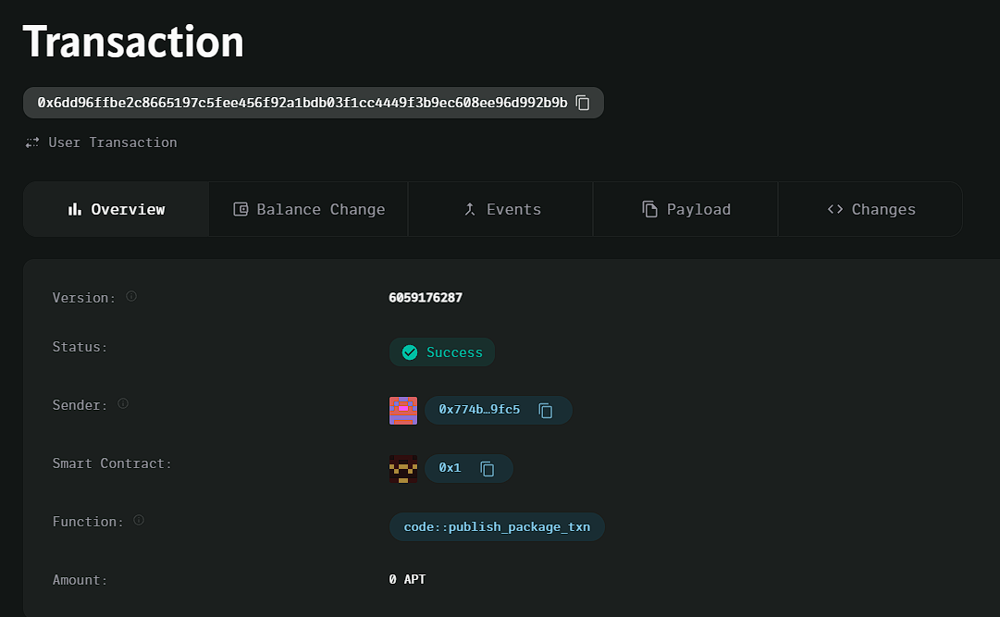

### Deployed smartcontract address: 0x6dd96ffbe2c8665197c5fee456f92a1bdb03f1cc4449f3b9ec608ee96d992b9b

### Screenshot: 

# Token Voting System

## Project Title
Token Voting System

## Project Description
A decentralized application (dApp) where users can vote on proposals using tokens, with voting power proportional to the number of tokens they hold. Each vote is backed by a transfer of tokens, making the voting system decentralized and token-based.

## Vision
To create a transparent and secure voting system where token holders can actively participate in governance by voting on proposals. The more tokens a user holds, the more influence they have over decisions.

## Key Features
- **Proposal Creation**: Users can create new proposals for others to vote on.
- **Token-Based Voting**: Voting power is proportional to the number of tokens a user holds.
- **Secure Voting**: Voting requires transferring tokens to the proposal owner.

## Future Scope
- **Multi-token Support**: Allow the use of different tokens for voting.
- **Delegated Voting**: Enable users to delegate their votes to others.
- **Result Analysis**: Automatic calculation and display of proposal results based on token weightage.
